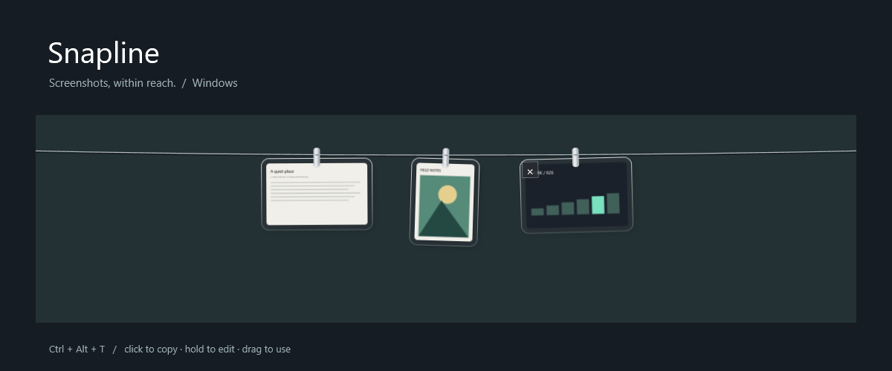
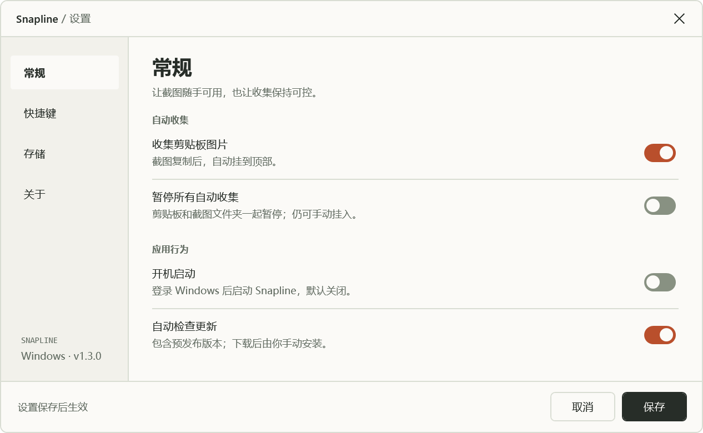

# Snapline · 截图晾衣绳 Windows 版

Snapline 是 [Tendedero](https://github.com/alejandrobujan/tendedero) 的**非官方 Windows 移植版**。原项目作者为 **[Alejandro Buján](https://github.com/alejandrobujan)**；本仓库由 [jiuyang5354](https://github.com/jiuyang5354) 发布 Windows 实现。它把截图挂在屏幕顶部，方便复制、预览、编辑和拖入其他应用。

An unofficial Windows implementation of Tendedero by Alejandro Buján, using C# / WPF and Win32. This project uses its own name and icon and is not endorsed by the upstream author.

**当前版本为 v1.3.1 预发布，安装版支持直接覆盖升级。** 安装器默认沿用旧版安装目录，正常退出该位置的旧程序并覆盖程序文件，保留截图、设置和已有快捷方式。新版截图栏与统一设置窗口继续提供原有功能，本机程序检查 110 / 110 通过；完整范围见 [验证记录](windows/QA.md)。



上图是实际 WPF 截图栏放在展示背景上的效果；卡片使用程序生成的测试图片。



新版设置包含常规、快捷键、存储、关于四页，保留原作者与许可信息。

## 下载和运行

- [下载 Windows EXE 安装包（默认创建桌面图标）](https://github.com/jiuyang5354/snapline-windows/releases/download/v1.3.1/Snapline-Windows-Setup-v1.3.1.exe)
- [下载 Windows 便携包](https://github.com/jiuyang5354/snapline-windows/releases/download/v1.3.1/Snapline-Windows-v1.3.1.zip)
- [下载可编译源码包](https://github.com/jiuyang5354/snapline-windows/releases/download/v1.3.1/Snapline-Windows-Source-v1.3.1.zip)
- [安装器源码与验证记录](https://github.com/jiuyang5354/snapline-windows/releases/download/v1.3.1/Snapline-Windows-Installer-Source-v1.3.1.zip) · [安装包 SHA-256](https://github.com/jiuyang5354/snapline-windows/releases/download/v1.3.1/SHA256SUMS-Setup.txt)
- [发布说明与 SHA-256 校验文件](https://github.com/jiuyang5354/snapline-windows/releases/tag/v1.3.1)

**安装版：** 双击 EXE，按中文向导安装。“创建桌面快捷方式”默认勾选，可取消；同时提供开始菜单入口和卸载入口。默认安装到 `%LOCALAPPDATA%\Programs\Snapline`，只安装给当前用户，不需要管理员权限。开机启动默认关闭。卸载保留原来的截图和设置，完整说明见 [安装版指南](windows/INSTALLER.zh-CN.md)。

另提供 [GitHub Packages 软件包](https://github.com/users/jiuyang5354/packages/nuget/package/jiuyang5354.Snapline.Windows)，包名为 `jiuyang5354.Snapline.Windows`，当前 NuGet 版本为 `1.3.1-preview`，已公开并关联本仓库。NuGet 包中的程序位于 `tools/Snapline/`，下载需要 GitHub 软件包认证；具体操作见 [软件包指南](windows/PACKAGE-README.md)。普通用户可选上面的 EXE 安装包或便携 ZIP。

目标系统为 **Windows 10 / 11，需 .NET Framework 4.8 或更高版本**。解压整个便携包，双击其中的 `Snapline.exe`。程序不需要管理员权限；运行后驻留系统托盘，图标也可能在“隐藏图标”菜单中。

当前程序未作代码签名，Windows 可能提示未知发布者。源码和编译脚本已公开，可以自行编译。

## 使用方法

1. 使用 `Win + Shift + S` 截图，或复制一张图片。
2. 在屏幕顶部悬停，点击托盘图标，或按 `Ctrl + Alt + T` 展开。
3. 顶部工具条可直接复制最近一张、暂停/恢复收集，或打开统一设置。
4. 单击图片复制，双击用默认图片应用预览，按住约 0.45 秒用画图编辑，也可以拖入其他应用。
5. 从托盘右键菜单选择“退出”关闭程序。

如果 `Ctrl + Alt + T` 已被占用，程序会尝试 `Ctrl + Alt + Shift + T`；两个组合键都被占用时，仍可通过托盘和顶部悬停操作。完整操作说明见 [中文使用指南](windows/README.zh-CN.md)。

## 自定义快捷键

截图栏 → **设置 → 快捷键**，或右键系统托盘图标 → **设置快捷键…** → 在输入框按下想绑定的按键 → **保存**。新快捷键用于显示 / 隐藏晾衣绳，保存后立即生效，重启后继续使用。

支持普通单键、功能键，以及 Ctrl / Alt / Shift / Win 与一个普通按键的组合，例如 `F8`、`Ctrl + Shift + Space`。可点击输入框重新录入，或选择“恢复默认”后保存；取消会保留原绑定。

单键会占用其他应用中的同名按键；绑定字母或数字时建议使用组合键。修饰键须搭配普通按键，F12 为系统保留键。已被占用或无法注册的组合会提示原因并保留原快捷键。如果重启时保存的组合被其他软件占用，程序会提示并尝试默认和备用组合，保存的偏好仍保留。

## 更新与便捷操作

顶部工具条和统一设置窗口可使用常用操作，托盘菜单保留原有入口：

| 功能 | 使用与默认状态 |
| --- | --- |
| 自动检查更新（含预发布） | 默认开启。启动约 15 秒后检查，之后每 24 小时最多检查一次；同一版本只提醒一次。可关闭，手动检查仍可用。 |
| 检查更新 / 更新到新版本 | 查看更新说明、选择保存位置、下载并校验便携 ZIP。通知不可见时也可从托盘打开。另有“打开版本发布页”入口。 |
| 暂停所有自动收集 | 同时暂停剪贴板图片和文件夹新图片，重启后保持暂停。取消勾选后恢复，跳过暂停期间的图片。已有图片仍可复制、预览，也可手动挂入。 |
| 复制最近一张 | 无须展开晾衣绳，直接复制当前列表最近一张图片；没有图片时禁用。 |
| 开机启动 | 默认关闭，仅在勾选后设置当前 Windows 用户登录时启动，不需要管理员权限。移动或重新解压程序后请重新勾选，以更新路径。 |

**升级到 v1.3.1：** 已用 EXE 安装的用户直接运行新版安装包即可，默认在原目录覆盖，旧进程正常退出后再替换文件，应用列表保留一份登记；已有快捷方式的自定义数据目录参数与开机启动项保留。便携版没有安装登记，需先退出旧版，再将新版解压到选定目录。截图、列表及自定义快捷键仍在原数据目录。程序内自动更新继续提供检查、提醒与便携 ZIP 下载，也可从发布页选择 EXE 安装包。

更新仅读取本仓库公开的版本文件，并在点击下载时访问 GitHub 发布包。程序校验包的大小与 SHA-256，下载取消、失败或校验不通过时不会替换已保存的包。离线检查静默失败，手动检查会提示；不需要登录 GitHub。

## 使用注意事项

- **默认收集剪贴板中的图片，不仅是截图。** 从聊天、浏览器或其他应用复制的图片也会被保存。可在托盘关闭“收集剪贴板图片”，改为只监听指定文件夹；文字剪贴板不会保存。
- 收集的图片默认保存在 `%LOCALAPPDATA%\Snapline\Inbox`，设置在 `%LOCALAPPDATA%\Snapline\settings.json`。最多恢复最近 12 张，超出展示数量的旧文件仍会保留，需要自行按需清理。
- 点击图片叉号会把程序收件夹内的图片送入回收站；外部图片只从展示列表取下，保留原文件。“全部取下”保留文件。
- 拖放时由目标应用决定接收图片或文件，以及复制或移动。使用移动操作后，原文件可能离开原文件夹。
- 更新检查会向 `raw.githubusercontent.com` 请求本仓库的公开版本文件；点击下载会访问 GitHub 与其发布文件 CDN。请求包含程序版本，不上传截图、剪贴板内容或本地路径，也没有账号或遥测。关闭自动检查后，仅主动检查或下载时才联网。Windows 剪贴板同步及接收图片的其他应用仍按各自设置处理数据。
- 程序不接管系统截图快捷键，不修改截图工具的自动保存设置。开机启动默认关闭，可在托盘开启或关闭；便携程序移动后需更新注册路径。
- 透明外框使用 WPF 半透明效果，与 macOS 原生模糊材质有差异。预发布验证范围以 [QA.md](windows/QA.md) 为准。

## 编译

使用 Windows PowerShell 或 PowerShell 7，在仓库根目录运行：

```powershell
powershell.exe -NoProfile -ExecutionPolicy Bypass -File .\windows\build.ps1
```

生成的程序位于 `windows/bin/Snapline.exe`。编译使用系统 .NET Framework C# 编译器，无第三方运行时依赖。如果系统缺少编译器，安装 .NET Framework 4.8 Developer Pack。

制作安装包另需 [NSIS 3.13](https://nsis.sourceforge.io/Download)。从官方 ZIP 解压编译器到 `windows/.tools/`，将已发布的便携 ZIP 放在 `windows/`，运行 `powershell.exe -NoProfile -ExecutionPolicy Bypass -File .\windows\package-installer.ps1 -Test`。脚本先校验便携 ZIP，再封装同一程序，输出 EXE、安装器源码 ZIP 与独立摘要；安装器验证结果保存在 `windows/qa/output/installer/installer-results.json`，详见 [安装版指南](windows/INSTALLER.zh-CN.md)。

运行现有验证和打包脚本：

```powershell
powershell.exe -NoProfile -ExecutionPolicy Bypass -File .\windows\build.ps1 -Test
powershell.exe -NoProfile -ExecutionPolicy Bypass -File .\windows\package.ps1
```

测试会临时使用系统剪贴板，结束时恢复能读取的原格式；测试期间请暂停复制操作。测试图片与状态使用 `windows/qa/output/` 中的独立目录。

维护发布时，`package.ps1` 根据 EXE 版本生成 ZIP、`SHA256SUMS.txt` 与 `windows/dist/update.json`。先上传并核对发布文件，再将该版本文件复制至仓库根目录的 `update.json` 并推送，避免客户端提示尚未完成上传的版本。版本文件的 `prerelease` 应与 GitHub Release 的状态一致。

发布 GitHub Release 后，`Publish Windows package` 工作流会自动下载该版本的便携 ZIP，核对 GitHub 资产摘要、SHA-256 文件与 EXE 版本，再发布到 GitHub Packages。预发布的 NuGet 版本带 `-preview` 后缀。工作流发布后会重新下载安装包，逐个核对全部便携文件并检查仓库关联；也可在 Actions 中手动运行，输入已发布的标签。软件包可见性可在 `Package settings` 中查看和管理，具体操作见 [GitHub 官方说明](https://docs.github.com/en/packages/learn-github-packages/configuring-a-packages-access-control-and-visibility)。本次 [发布验证](https://github.com/jiuyang5354/snapline-windows/actions/runs/37729018383)已通过，包含全部 8 个便携文件的下载校验与公开状态、仓库关联检查。

## 原作者与许可

- 原项目：[alejandrobujan/tendedero](https://github.com/alejandrobujan/tendedero)。
- 原作者：**Alejandro Buján**。
- 参考的上游提交：[`3c866d94d25ee9d1e008aecd9a78a4e9b2bf06a4`](https://github.com/alejandrobujan/tendedero/commit/3c866d94d25ee9d1e008aecd9a78a4e9b2bf06a4)。
- Windows 实现：C# 5、WPF、.NET Framework 4.8 与 Win32；本仓库只发布 Windows 实现及其文档。

上游代码采用 MIT 许可，但原项目名称、原图标及 `docs/` 图片不在其授权范围内。按上游要求，本版本使用 **Snapline** 名称和新绘制的图标，发布内容不包含原图标或宣传图片，也不代表原作者背书。

原作者版权与完整上游许可保留在 [UPSTREAM-LICENSE.txt](UPSTREAM-LICENSE.txt)。Windows 实现按 [MIT 许可](LICENSE) 提供，详细来源说明见 [NOTICE.md](NOTICE.md)。
